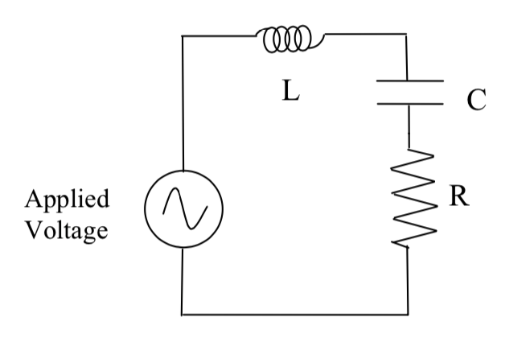

# Introduction
The current through a series LRC circuit is examined as a function of applied frequency and the effects of changing the values of the resistance, inductance, and capacitance are observed. The phase difference between the applied voltage and the current is measured below resonance, at resonance, and above resonance. An inductor, a capacitor, and a resistor are connected in series with a sine wave generator. If the applied voltage is:

$J=J_{max}\sin(\omega t)$

then the current in the series LRC circuit is:

$I=I_{max}\sin(\omega t + \phi)$

The maximum current and total voltage are then related by:

$I_{max}=\frac{E_{max}}{Z}$

Where $Z$ is the impedance and is the AC analog of resistance for the entire circuit. The phase shift is related to the other variables by:

$\tan\phi=\frac{X_C-X_L}{R}$

$\phi=\frac{\Delta t}{T}\cdot 2\pi$

Where $\Delta t$ is the time difference between each peak, $T$ is the period of the wave. The impedance $Z$ is given by:

$Z=\sqrt{R^2+(X_C-X_L)^2}$

  

Since the voltage across the resistor is in phase with the current, the phase of the current can be measured by measuring the phase of the voltage across the resistor.

$X_C=\frac{1}{\omega C}=\frac{1}{2\pi fC}$

$X_L=\omega L=2\pi fL$

Where $L$ is the inductance measured in henrys $H$, $C$ is the capacitance measured in farads $F$, and $f$ is the frequency measured in hertz $Hz$. At resonance, the current is maximum and thus the impedance is at its minimum. The minimum impedance (6) is equal to $R$ due to $X_L=X_C$. This yields the resonant frequency:

$\omega_{res}L=\frac{1}{\omega_{res}C}$

$\omega_{res}=\sqrt{\frac{1}{LC}}$
